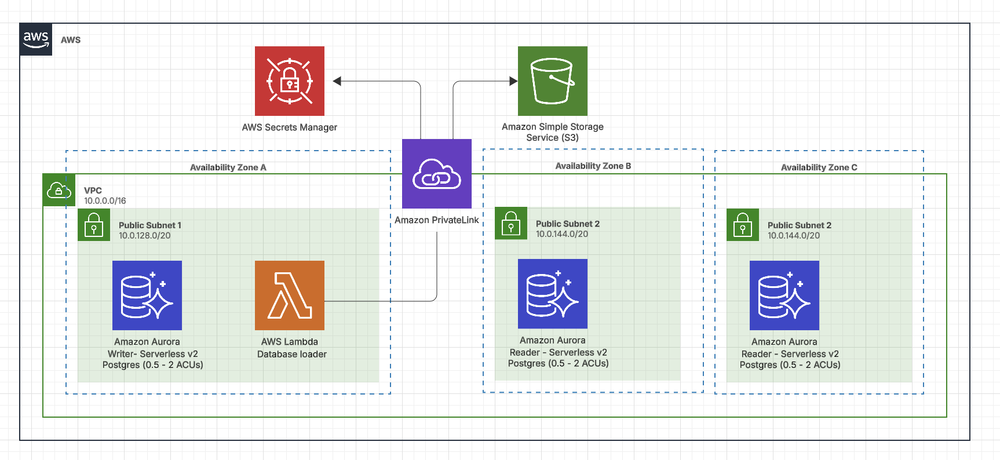

# Analytic-agent
The purpose of this repository is to provide the necessary compute and storage to develop an intelligent agent that can be used to query a relational database using plain English to produce analytic reports.

The intent is twofold: allow agent developers to concentrate on developing the value add agent, rather than the compute infrastructure, and to understand the obstacles in creating a production quality agent. 

## Architecture Overview

This project is implemented using the infrastructure-as-aservice (IaaS) [AWS Cloud Development Kit (CDK)](https://aws.amazon.com/cdk/), implemented using the Python SDK. 

It consists of two stacks, located in the `./iac` directory:

**Data Stack** - This consists of a single S3 bucket and loads a sample dataset consisting of a single file (`./data/chinook.sql`). [This is a simple relational data set](https://github.com/lerocha/chinook-database/blob/master/LICENSE.md) made up of albums, songs, tracks, artists, etc.

**Database Stack** - This consists of an AWS Aurora RDS Postgres deployment, a single lambda to load the sample dataset, and all the permissioning needed to execute both in a private VPC. 
